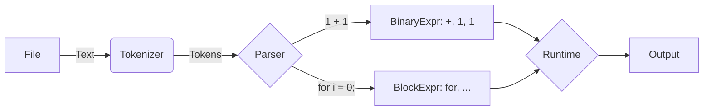

**Hi, I'm Josh. 
I'm a young pasionate software-developer that loves building complex applications. 
I have always entertained the idea of sometime writting my own language, so I finnaly did it.**

**Introducing Rash, the reasonable bash alternative. An easy to write scripting language that has very easy shell access**

### Goal:

The goal of the language is to provide easy to use access to commands, I achieve this via the concept of command strings:

```go {filename=script.rash}
url = "https://pokey.remington.boo" // Great website
c"curl ${url}"
```

Command strings allow you to easily embed variables into your shell commands

### Benchmark:

| Language     | Time      |
|--------------|-----------|
| Rash 🚀      | 4.76s*    |
| Bash 🗑️      | 2.60s     |
| Python 🐍    | 1.45s     |
| Rust 🦀      | 0.35s     |
| JavaScript 🟨| 4.87s     |
| TypeScript 🟦| 4.57s     |

#### Code tested:

```go {filename=compare.rash}
for i = 0; i < 100; ++i; {
  for j = 0; j < 100; ++j; {
    for k = 0; k < 100; ++k; {
	    print(i * j * k);
    }
  }
}
```

Obviously this benchmark is very primitive but it does the job.
<br/>* Also i am not claiming that my language is actually faster than JS (nodejs), it simply isn't and it never will be, this is a quite unfair comparison
of my worst found time for node and my best time for rash.

### How it works:

Rash is an interpreted language, it like many other languages uses a regex tokenizer/lexer, than a recursive abstract syntax tree parser and finally the runtime


